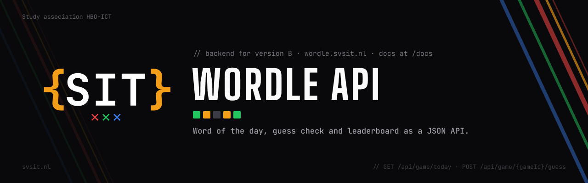

# SIT Wordle API

Backend for the [SIT Wordle Hackathon](https://github.com/molindemol/sitHackathonWordle): the word of the day, the guess check and a small leaderboard as a JSON API. Teams that pick version B build their frontend against this.

Live: **https://wordle.svsit.nl** (also reachable as https://sit-wordle-api.vercel.app). Interactive docs with a try-it panel: **https://wordle.svsit.nl/docs**, raw spec at `/openapi.json`.

The secret word never leaves the server. The word of the day follows from the date and a secret, and every game id is signed, so there is nothing to store except scores. No database.

## Endpoints

Every response has the same shape: `{ "data": ..., "error": null, "meta": null }`. On an error `data` is `null` and `error` is a sentence you can show.

| Method | Path | Does | `data` |
|---|---|---|---|
| `GET` | `/api/game/today` | Today's game, without the word | `{ gameId, date, wordLength: 5, maxGuesses: 6 }` |
| `POST` | `/api/game/{gameId}/guess` | Body `{ guess }`. Checks the word and colours the letters | `{ valid, result: ["correct","present","absent",...], solved }` |
| `GET` | `/api/words/check?word=apple` | Is this a real word | `{ valid }` |
| `POST` | `/api/scores` | Body `{ teamName, guesses, timeMs }`. Saves a score for today | `{ rank }` |
| `GET` | `/api/scores/today` | Top 10 of today, `meta.total` has the count | `[ { teamName, guesses, timeMs } ]` |
| `POST` | `/api/practice` | Starts a practice game with a random word | `{ gameId, wordLength, maxGuesses }` |
| `GET` | `/` | Lists the endpoints | |
| `GET` | `/docs` | Interactive API reference (OpenAPI 3.1, Scalar) in the SIT house style | HTML |
| `GET` | `/openapi.json` | The OpenAPI spec | JSON |

Status codes: `400` bad input, `404` unknown or forged `gameId`, `429` more than 60 requests per minute from one IP, `500` our fault.
A guess that is not in the word list is not an error: `valid` is `false`, `result` is `null`, HTTP 200.

CORS is open for every origin, so `index.html` opened from disk or via localhost works. Full contract with example code for teams: [API.md in the starter kit](https://github.com/molindemol/sitHackathonWordle/blob/main/API.md).

## Run it locally

```
npm install
cp .env.example .env.local     # then put a long random string in GAME_SECRET
npm run dev                    # http://localhost:3000
```

Check it end to end while it runs:

```
npm run smoke
```

## Deploy on Vercel

1. Import this repo in Vercel (framework preset: Next.js, no other settings).
2. Add one environment variable: `GAME_SECRET`, a long random string. Generate one with:
   ```
   node -e "console.log(require('crypto').randomBytes(32).toString('hex'))"
   ```
3. Deploy. `wordle.svsit.nl` is attached under Domains: svsit.nl lives in another Vercel team, so ownership was proven with a `_vercel` TXT record at Hostnet, and the subdomain uses two A records (216.198.79.1 and 64.29.17.1) because a null MX record on that name blocked a CNAME.

Changing `GAME_SECRET` changes the word of the day and invalidates every game id that is out there, so set it once.

## Where the scores live

Scores are kept in the memory of the running server, per day. That keeps the project free of databases and accounts, and it has one consequence: on Vercel a new serverless instance starts empty, so the leaderboard can reset or differ between instances. The game itself is stateless and is not affected.

For the hackathon the reliable setup is to run the API on the host's laptop in the room (`npm run dev`) and share that address, or to treat the Vercel leaderboard as best effort. Everything else can stay on Vercel.

## Reference client

`examples/wordleClient.html` is a complete version B frontend in one file: grid, keyboard, colouring via the API, practice games, score submission and the leaderboard. Open it from disk; add `?api=http://localhost:3000` to point it at a local backend. It is for the crew (demo, mentor fallback, beamer leaderboard), not for the starter kit.

## How it works

- `lib/game.ts`: word of the day is `HMAC-SHA256(GAME_SECRET, "daily:" + date)` modulo the answer list. Game ids are `base64url(payload).base64url(signature)`, verified with a timing-safe compare.
- `lib/checkGuess.ts`: two passes, greens first, then yellows from what is left, so double letters colour like real Wordle.
- `lib/rateLimit.ts`: sliding window of 60 per minute per IP, in memory.
- `lib/openapi.ts`: the OpenAPI spec as one TypeScript object, served by `/openapi.json` and rendered by `/docs`.
- `data/validWords.ts`: 14,855 valid guesses from [tabatkins/wordle-list](https://github.com/tabatkins/wordle-list) (MIT). `data/answers.ts`: 5,665 more common words (Knuth's sgb-words, intersected with the guess list) that can be the answer.
- Dates are in Europe/Amsterdam.

## Development

```
npm test               # vitest
npm run type-check     # tsc
npm run build          # next build
```

## License

Internal tooling of study association SIT. Free to reuse and adapt.
