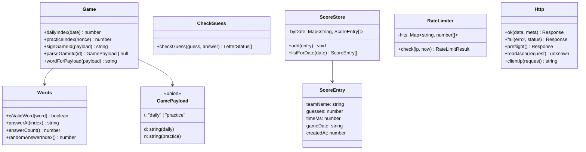

# Class diagram: SIT Wordle API

```mermaid
classDiagram
  class GamePayload {
    <<union>>
    t: "daily" | "practice"
    d: string (daily)
    n: string (practice)
  }
  class Game {
    +dailyIndex(date) number
    +practiceIndex(nonce) number
    +signGameId(payload) string
    +parseGameId(id) GamePayload | null
    +wordForPayload(payload) string
  }
  class Words {
    +isValidWord(word) boolean
    +answerAt(index) string
    +answerCount() number
    +randomAnswerIndex() number
  }
  class CheckGuess {
    +checkGuess(guess, answer) LetterStatus[]
  }
  class ScoreEntry {
    teamName: string
    guesses: number
    timeMs: number
    gameDate: string
    createdAt: number
  }
  class ScoreStore {
    -byDate: Map~string, ScoreEntry[]~
    +add(entry) void
    +listForDate(date) ScoreEntry[]
  }
  class RateLimiter {
    -hits: Map~string, number[]~
    +check(ip, now) RateLimitResult
  }
  class Http {
    +ok(data, meta) Response
    +fail(error, status) Response
    +preflight() Response
    +readJson(request) unknown
    +clientIp(request) string
  }
  Game --> Words
  Game --> GamePayload
  ScoreStore --> ScoreEntry
```
